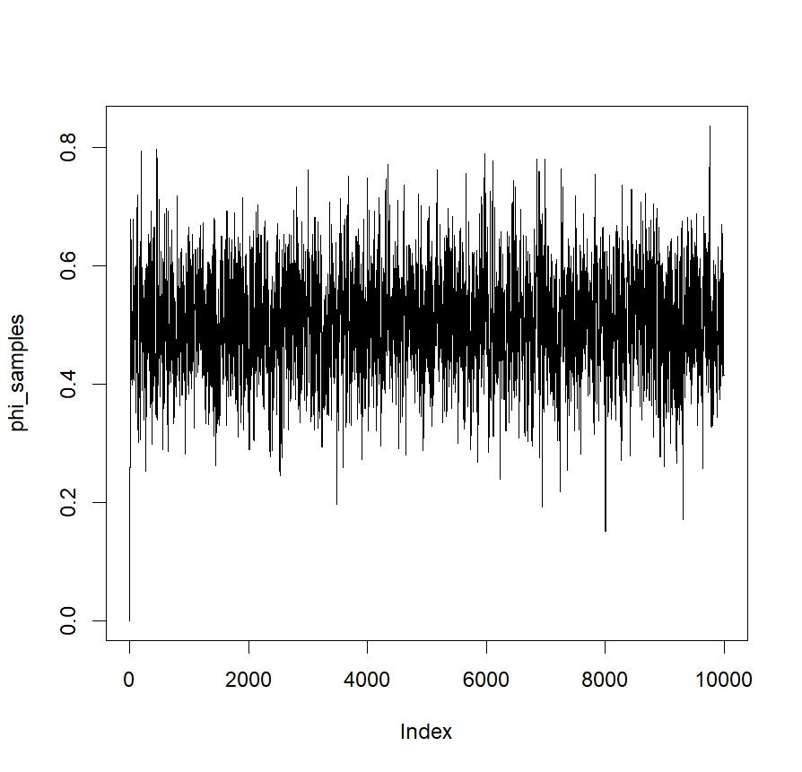
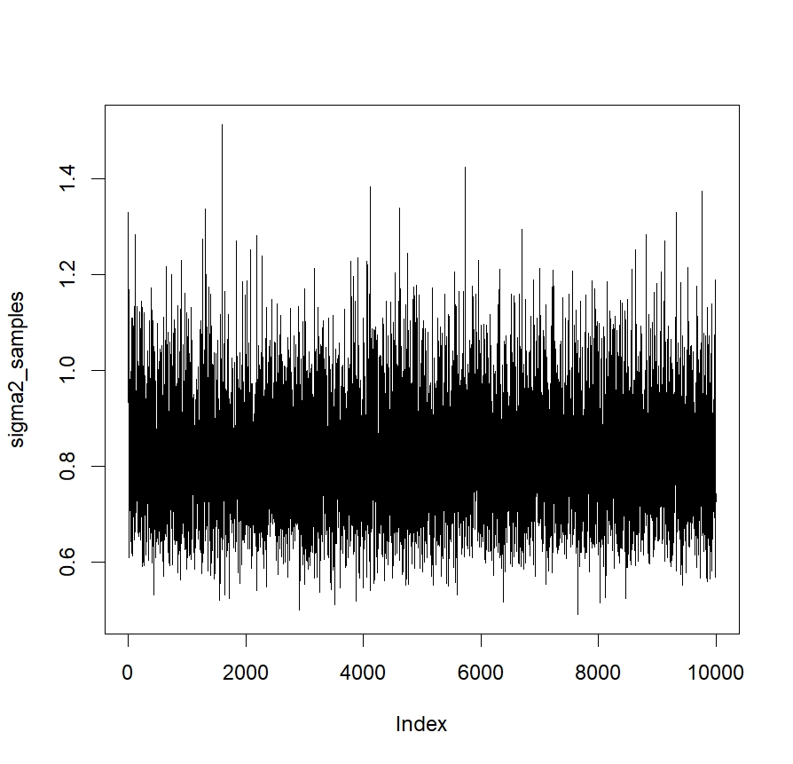



## MH算法

### MH算法基本步骤

1. 初始化: 选择一个初始状态 $x_0$

2. 对于每一步 $t=1,2, \ldots, T$
   - 建议步骤: 从建议分布 $q(x' \mid x_t)$ 中抽取一个候选状态 $x'$
   - 接受步骤: 以以下的接受概率 $A(x_t, x')$ 接受候选状态:
   $$
   A(x_t, x')=\min \left(1, \frac{p(x') q(x_t \mid x')}{p(x_t) q(x' \mid x_t)}\right)
   $$

如果接受，则 $x_{t+1}=x'$，否则 $x_{t+1}=x_t$.

这里， $p(x)$ 是我们想要采样的目标分布， $q(x' \mid x_t)$ 是给定当前状态 $x_t$ 时，提议一个新状态 $x'$ 的建议分布.

### 为什么这样能够工作?

关键在于保证马尔可夫链的平稳分布 (stationary distribution) 是我们要抽样的目标分布。 平稳分布 $\pi(x)$ 是一个分布，对其而言，如果我们从该分布中抽取一个样本并应用转移核，新 的样本仍然服从 $\pi(x)$ 。数学上我们可以表达为:
$$
\pi\left(x^{\prime}\right)=\sum_x \pi(x) P\left(x^{\prime} \mid x\right)
$$
这里， $P\left(x^{\prime} \mid x\right)$ 是从状态 $x$ 到状态 $x^{\prime}$ 的转移概率。
$\mathrm{MH}$ 算法通过精心设计的接受准则确保了其转移核满足{\color{brown} 细致平稳条件}，也就是说，对于任意的 状态 $x$ 和 $x^{\prime}$ ，以下等式成立:
$$
\pi(x) P\left(x^{\prime} \mid x\right)=\pi\left(x^{\prime}\right) P\left(x \mid x^{\prime}\right)
$$

其中 $P\left(x^{\prime} \mid x\right)$ 是总的从状态 $x$ 到状态 $x^{\prime}$ 的转移概率，包括了提议和接受两个步骤，可以写 作:

$$
P\left(x^{\prime} \mid x\right)=q\left(x^{\prime} \mid x\right) A\left(x, x^{\prime}\right)
$$

通过MH算法的接受准则，我们可以验证细致平稳条件确实成立:

$$\pi(x) q\left(x^{\prime} \mid x\right) A\left(x, x^{\prime}\right)=\pi\left(x^{\prime}\right) q\left(x \mid x^{\prime}\right) A\left(x^{\prime}, x\right)$$

由于 $A\left(x, x^{\prime}\right)=\min \left(1, \frac{\pi\left(x^{\prime}\right) q\left(x \mid x^{\prime}\right)}{\pi(x) q\left(x^{\prime} \mid x\right)}\right)$和$A\left(x^{\prime}, x\right)=\min \left(1,\frac{\pi(x) q\left(x^{\prime} \mid x\right)}{\pi\left(x^{\prime}\right) q\left(x \mid x^{\prime}\right)}\right)$ ，我们可以看 到这两边确实是相等的，从而确保了平稳分布 $\pi(x)$ 就是我们要采样的分布 $p(x)$.

## Note

### 为什么设置的是$A\left(x_t, x^{\prime}\right)=\min \left(1, \frac{p\left(x^{\prime}\right) q\left(x_t \mid x^{\prime}\right)}{p\left(x_t\right) q\left(x^{\prime} \mid x_t\right)}\right)$

Metropolis-Hastings (MH) 算法中的接受概率
$$
A\left(x_t, x^{\prime}\right)=\min \left(1, \frac{p\left(x^{\prime}\right) q\left(x_t \mid x^{\prime}\right)}{p\left(x_t\right) q\left(x^{\prime} \mid x_t\right)}\right)
$$
是一个精心设计的准则，旨在确保生成的样本 $x$ 的分布最终收敛到目标分布 $p(x)$ 。这里的 $x_t$ 是当前状态， $x^{\prime}$ 是建议的下一个状态， $q\left(x_t \mid x^{\prime}\right)$ 是从状态 $x^{\prime}$ 到状态 $x_t$ 的转移概率， $p(x)$ 是我们想要采样的分布。

理解这个接受概率的一个简单方法是考虑比率
$$
\frac{p\left(x^{\prime}\right) q\left(x_t \mid x^{\prime}\right)}{p\left(x_t\right) q\left(x^{\prime} \mid x_t\right)}
$$

分子 $p\left(x^{\prime}\right) q\left(x_t \mid x^{\prime}\right)$ : 这部分表示我们建议从状态 $x^{\prime}$ 移动到 $x_t$ 并且 $x^{\prime}$ 本身的概率。实际 上，这部分衡量了建议的状态 $x^{\prime}$ 到当前状态 $x_t$ 的“前进”概率.

分母 $p\left(x_t\right) q\left(x^{\prime} \mid x_t\right)$ : 这部分表示我们建议从状态 $x_t$ 移动到状态 $x^{\prime}$ 并且 $x_t$ 本身的概率。这 部分衡量了当前状态 $x_t$ 到建议状态 $x^{\prime}$ 的“前进”概率.

这个比率的直观意义是一个“平衡”：我们想要平衡从当前状态到建议状态的前进概率和反方向 的前进概率。

- 当这个比率大于1时，我们总是接受建议的状态，因为这意味着建议的状态比当 前状态更可能来自目标分布.
- 当这个比率小于1时，我们只有一定的概率接受建议的状态，这个概率正比于比率的大小.

### 为什么引入均匀分布？

均匀分布在 $\mathrm{MH}$算法中的角色体现在决定是否接受建议状态的步骤. 具体来说，即使建议状态 的接受概率 $A\left(x_t, x^{\prime}\right)$ 小于1，我们仍然有可能接受它，这样做可以防止算法过早地陷入局部 最优解并增加探索性。我们通常通过以下方式使用均匀分布:

1. 从均匀分布 $U(0,1)$ 中抽取一个随机数 $u$.
2. 如果 $u \leq A\left(x_t, x^{\prime}\right)$ ， 接受建议状态，否则保持当前状态不变.

使用均匀分布的这一步增加了算法的随机性，并允许它有可能接受一个在目标分布下不太可 能的状态，从而增加了算法的探索能力.

## Gibbs sampling

Gibbs抽样是一种特殊的Metropolis-Hastings（MH）算法，其中提议分布是条件分布，而接受概率始终为1. 这意味着Gibbs抽样总是接受新提议的样本.

Gibbs抽样是一种在高维分布上进行抽样的方法。对于一个 $d$ 维分布 $p\left(x_1, x_2, \ldots, x_d\right)$ ， Gibbs抽样在每一步依次对每一个变量 $x_i$ 进行抽样，条件于其他所有变量的当前值:
$$
x_i^{(t+1)} \sim p\left(x_i \mid x_1^{(t+1)}, x_2^{(t+1)}, \ldots, x_{i-1}^{(t+1)}, x_{i+1}^{(t)}, \ldots, x_d^{(t)}\right),
$$
这里， $(t)$ 是迭代的步数.

Gibbs抽样作为MH算法的特例:

为了理解Gibbs抽样是如何成为 $\mathrm{MH}$ 算法的一个特例的，我们需要考虑 $\mathrm{MH}$ 算法的两个主要步骤: 建议 (proposal) 和接受 (acceptance).

- 在MH算法中:
    1. 建议步骤: 从建议分布 $q\left(x^{\prime} \mid x\right)$ 中抽样一个候选样本.
    2. 接受步骤: 以一定的接受概率 $A\left(x, x^{\prime}\right)$ 接受这个样本.
- 在Gibbs抽样中:
    1. 建议步骤: 从完全条件分布中抽样.
    2. 接受步骤: 总是接受从条件分布中抽样出的样本.

如果我们将Gibbs抽样的建议步骤视为 $\mathrm{MH}$ 算法中的一个特殊情况，其中建议分布是条件分 布，那么Gibbs抽样的接受概率可以计算为:
$$
A\left(x, x^{\prime}\right)=\min \left(1, \frac{p\left(x^{\prime}\right) q\left(x \mid x^{\prime}\right)}{p(x) q\left(x^{\prime} \mid x\right)}\right)
$$
由于在Gibbs抽样中 $q\left(x^{\prime} \mid x\right)=p\left(x_i^{\prime} \mid x_{-i}\right)$ ，其中 $x_{-i}$ 表示除了 $x_i$ 之外的所有变量，我们可 以得出:
$$
A\left(x, x^{\prime}\right)=\min \left(1, \frac{p\left(x_i^{\prime} \mid x_{-i}^{\prime}\right) p\left(x_{-i}^{\prime}\right)}{p\left(x_i \mid x_{-i}\right) p\left(x_{-i}\right)}\right)
$$
由于 $x_{-i}^{\prime}=x_{-i}$ ，我们可以简化这个比例为:
$$
A\left(x, x^{\prime}\right)=\min \left(1, \frac{p\left(x_i^{\prime} \mid x_{-i}\right)}{p\left(x_i \mid x_{-i}\right)}\right)
$$
但是由于 $x_i^{\prime}$ 是直接从分布 $p\left(x_i^{\prime} \mid x_{-i}\right)$ 中抽样出来的，我们知道这个比例总是等于1，因此接受概率总是1.

这就解释了为什么说Gibbs抽样是MH算法的一个特例: Gibbs抽样总是接受新抽样出的样本，因此它可以被看作是MH算法中建议分布总是等于条件分布，接受概率总是 1 的一个特殊情况.

## Example

### AR(1)模型示例

考虑一个AR(1)模型:
\[ y_t = \phi y_{t-1} + \epsilon_t \]
其中 \( \epsilon_t \sim N(0, \sigma^2) \)。

我们的目标: 给定观测值 \( y_1, y_2, ... y_n \)，使用MCMC估计 \( \phi \)。

1. 基于AR(1)模型定义似然函数 \( p(y|\phi) \)。
2. 为 \( \phi \) 定义一个先验 \( p(\phi) \)。
3. 结合似然和先验得到后验 \( p(\phi|y) \)。
4. 使用Metropolis-Hastings算法（一种MCMC形式）从后验中抽取样本.

## R code

```R

# Simulate some data
set.seed(123)
n <- 100
phi_true <- 0.5
sigma_true <- 1
y <- arima.sim(n=n, list(ar=phi_true, order=c(1,0,0), sd=sigma_true))
plot(y,type='l')
# Initialize parameters for Gibbs sampler
niter <- 10000
phi_samples <- numeric(niter)
sigma2_samples <- numeric(niter)
phi_samples[1] <- 0  # starting value for phi
sigma2_samples[1] <- 1  # starting value for sigma^2

s2 <- 10  # variance for phi prior
alpha <- 0.01
beta <- 0.01

for (i in 2:niter) {
        # Update phi using Metropolis-Hastings
        phi_candidate <- rnorm(1, phi_samples[i-1], 0.1)
        acceptance_ratio <- exp((sum(dnorm(y[-1], mean=phi_candidate*y[-n], sd=sqrt(sigma2_samples[i-1]), log=TRUE)) + dnorm(phi_candidate, 0, sqrt(s2), log=TRUE)) - (sum(dnorm(y[-1], mean=phi_samples[i-1]*y[-n], sd=sqrt(sigma2_samples[i-1]), log=TRUE)) + dnorm(phi_samples[i-1], 0, sqrt(s2), log=TRUE)))
        if (runif(1) < acceptance_ratio) {
            phi_samples[i] <- phi_candidate
        } else {
            phi_samples[i] <- phi_samples[i-1]
        }
        
        # Update sigma^2 using inverse gamma distribution
        residuals <- y[-1] - phi_samples[i] * y[-n]
        alpha_star <- alpha + n/2
        beta_star <- beta + 0.5 * sum(residuals^2)
        sigma2_samples[i] <- 1 / rgamma(1, alpha_star, beta_star)
}

mean(phi_samples[2000:niter])
mean(sigma2_samples[2000:niter])

# Plot results
plot(phi_samples, type="l")
plot(sigma2_samples, type="l")
```




