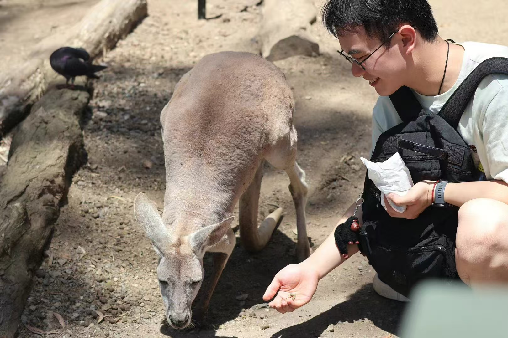

:::::: {.columns .home-layout}
:::: {.column width="46%"}
{.profile-photo fig-alt="Renhe Wang"}

## Renhe Wang

## 王人和

::: profile-links
[<i class="bi bi-envelope-at"></i>](mailto:ronniewanger@gmail.com){aria-label="Email" title="ronniewanger@gmail.com"}

[<i class="bi bi-github"></i>](https://github.com/Ronniebattler){aria-label="GitHub" title="github.com/Ronniebattler"}

:::

::::

::: {.column width="50%"}
# Hey, there!👋

I am currently a PhD candidate at Monash University supervised by [**Prof. Jiti Gao**](https://research.monash.edu/en/persons/jiti-gao) and [**Prof. Xibin Zhang**](https://research.monash.edu/en/persons/xibin-zhang).

[Download my CV](Files/CV_Renhe_Wang.pdf){.btn .btn-primary .cv-button}

# Key Research Interests

- High-dimensional models
- Network models
- Time-varying models
- Markov switching

# Awards

- MONASH Graduate Scholarship (MGS), 2025-2028
- MONASH International Tuition Scholarship (MITS), 2025-2028
- National Scholarship, 2023
:::
::::::
